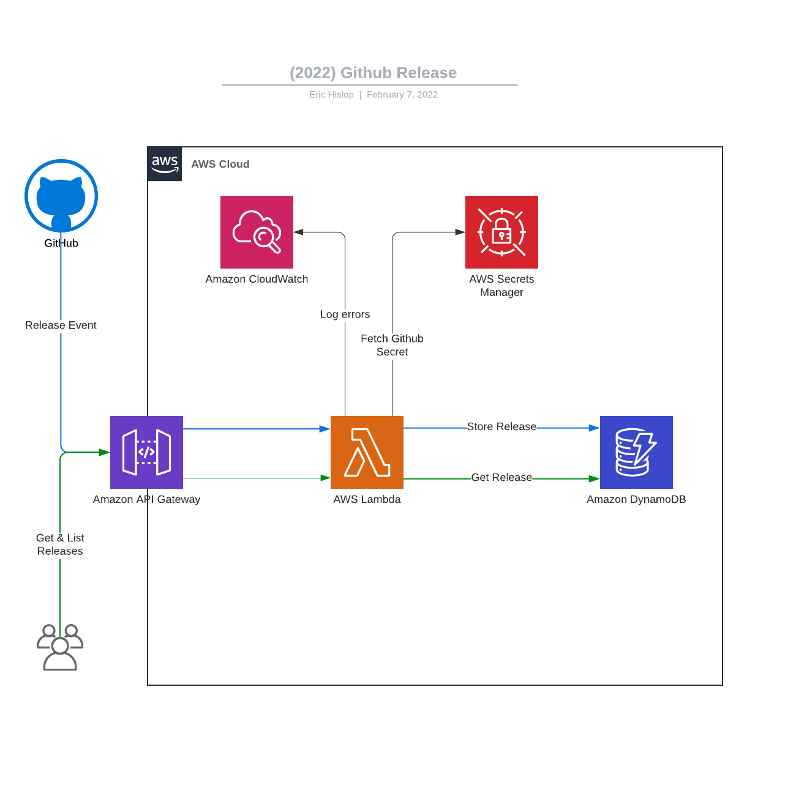

# Github Release app

This is a project has setup a webhook to recieve events from this repo when a release happens.
It stores release events in DyanmoDB, which you can list and get by id.

I've built it with the Serverless framework and decided to use Typescript for the first time.

## Design



## Next steps
- Testing
- Use more Typescript features(Around event validation)
- Setup a Domain name
- Require API key on calls
- Figure out why Swagger/OpenApi fails to fetch
- Setup Github actions to trigger deploys when main is updated

## AWS services
- Lambda
- DynamoDB
- API gateway
- Secret Manager
- Cloud Watch

## Testing

GET: /releases [List all releases](https://joqab8sh79.execute-api.ap-southeast-2.amazonaws.com/releases)

GET: /releases/{id}

## Get started

```bash
npm install
```

```bash
serverless offline
```

## Deploying 

```bash
serverless deploy
```